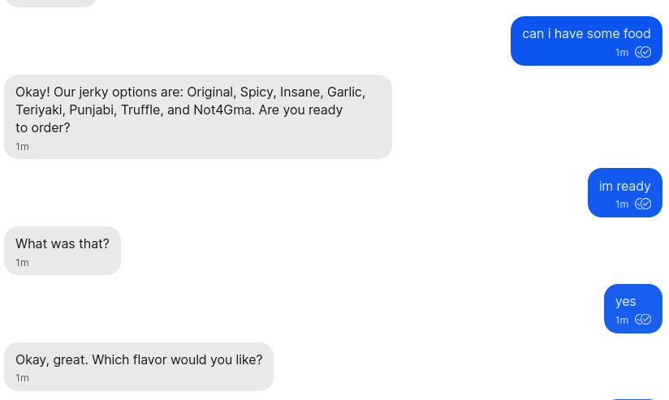
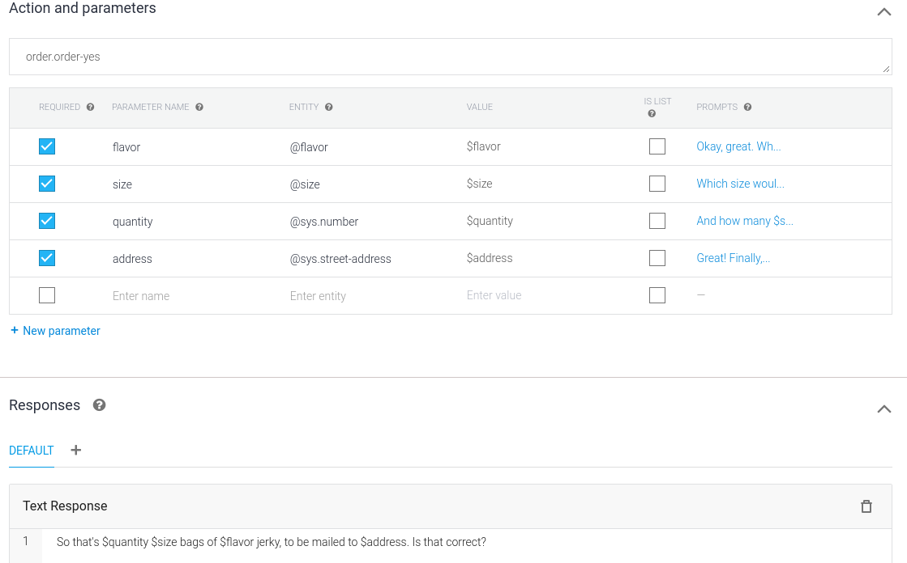

# DialogBot

This is a demo bot that uses Google Dialogflow for NLU and conversational context. Dialogflow is powerful and accurate, and has integrations with several other platforms. This demo is a step toward full integration with Forest bots, though it needs more work before it can operate a MobileCoin wallet.

I've tried to use the Dialogflow Console in the way a low-code user would, building the minimum necessary integration with Forest. so that designers and product people could build their bots without having to engage with much of the underlying code. They can focus on the flow of business logic and conversation.

Right now the DialogBot connects to a DialogFlow agent that follows the same script as [jerkybot](https://github.com/mobilecoinofficial/forest/blob/jerkybot/jerkybot.py). This is a very simple bot as far as DialogFlow goes, but the flexibility it provides for both the user and the developer is far beyond what's currently possible in Forest.



*The bot takes fuzzy inputs and maintains context when it doesn't understand*


*Slot filling is more rigid but gets better with synonyms*

## Installation

To run a bot through DialogFlow, we have to use Google Cloud Platform. This is the biggest drawback, partly because of privacy and cost concerns, and partly because the GCP interface is bureacratic and confusing.

To successfully run DialogBot, follow these steps:

### Make a GCP project and service account
1. If you don't already have an account with Google Cloud Platform, [sign up for a free trial](https://console.cloud.google.com/freetrial/signup/). You'll need a phone number for verification and a credit/debit card for billing.
2. Go to the [Cloud Resource Manager](https://console.cloud.google.com/cloud-resource-manager) and find or make a new project. You'll need the Project ID to connect your DialogFlow app.
3. Go to the [Service accounts](https://console.cloud.google.com/iam-admin/serviceaccounts) page. A service account is just a login that your bot can use. Find the project with ID you just got in step 2 and click on it.
4. Click "Create Service Account". Give it a name and click "Create and Continue".
5. In the "Select a role" box, search for "DialogFlow" and give your bot access to the "DialogFlow API Admin" role. Click "Continue" and then "Done" to finish.
6. Click on the email address of the new service account. Go to the "Keys" tab. Click "Add a key → Create new key → Create". A JSON file will be downloaded. It contains the account credentials for the service account. 

### Make a DialogFlow agent
1. Open the [DialogFlow Console](https://dialogflow.cloud.google.com/) and log in with the same Google account. If you haven't yet accepted the terms and conditions you will be prompted to do so.
2. Click "Create Agent" in the menu. Enter an agent name. In the Google Project box, select the Project ID you found in step 2.
3. Build (or import) your agent in the DialogFlow Console. If you want to run jerkybot, you can import the `jerkybot.zip` file from this branch and all the intents and entities will be loaded for you.

### Run DialogBot
1. Clone the Forest repo from this branch. Follow the instructions in the README to make a Signal bot.
2. Copy the JSON file for your service account into the repo folder.
3. Add a line to your `dev_secrets` file with the name of that JSON file, like so:
```
GOOGLE_APPLICATION_CREDENTIALS=projectid-12345-67890.json
```

You can now run `dialogbot.py`! It will accept hard-coded commands like a regular Forest bot, but if it doesn't think your message is a command, it will pass it on to DialogFlow to parse. Editing the agent in the DialogFlow console will work in real time, without needing to restart the program.

# DialogFlow notes

## API details

DialogFlow provides API integrations for external services. The service (in this case, Forest) does all the interaction with the user through the client, and just calls DialogFlow API at each conversational turn for intent parsing.


This means we could use Dialogflow for most of the intent parsing and conversation structures we currently put in layered Bot subclasses, and use Forest as a translation layer to Signal and Mobilecoin actions. 

Python client for the API is at https://cloud.google.com/dialogflow/es/docs/quick/api

The API integration for Twitter, as an example: https://github.com/GoogleCloudPlatform/dialogflow-integrations/blob/master/twitter/server.js


## Intent matching
- Intents are built from example inputs. Google NLU does pretty well at matching never-before-seen phrases to intents they should match to. It's harder to run analytics on this than with Rasa or Padatious, but it feels like it works better and has more world knowledge. It is definitely easier to train and update than either of those options.

## Entity selection
- DialogFlow has a bunch of Entity Types already built-in: numbers, measures, addresses, proper nouns and more. See [System Entities reference](https://cloud.google.com/dialogflow/es/docs/reference/system-entities) for more.
- You can also add your own entities, for things like the menu of jerky flavors. These are a little more brittle, as they have to match exactly to the example entities, but you can add synonyms for each entity to alleviate this problem.

## Conversational context
- DialogFlow uses Session IDs to keep track of which user the agent is talking to. Currently just sending the user's phone number as the session ID. Not ideal. Better would be the sourceUuid probably
- When designing an Agent you can designate a number of "contexts" for each intent. Contexts can be output or input; when an intent is found that has an output context, intents with a matching input context will be prioritized next. This allows for controlled direction of conversations without a rigid dialogue tree.
- Intents can have "followup intents", which are context-based but better for dialogue trees. The jerkybot uses this for walking through the ordering process, and confirming if the user asks to cancel. Followup intents are visualized as branches, like so:


## Slot filling
- Followup intents are kinda fragile, if they get their context messed with at all. There's also a built-in function for slot filling, where the bot will prompt for each required slot before moving to the next. This is more brittle and recommended against by some tutorials, but may be easier to reason about than followup intents.
- Jerkybot uses slot filling in the ordering process, to make sure it gets all the required information before moving to payment. It gathers a combination of custom entities and system entities and repeats them back to the user to confirm the order.




## Versioning
- DialogFlow Console has a manual versioning system, intended for making different versions of the bot for different environments. This is different than the SAVE button displayed prominently on each page. Intermediate saves are not version controlled.
- Technically all the agent-building stuff can be done from the SDK, instead of the Dialogflow Console. And you can definitely export the whole "agent" as a zip of jsons. Then it should be possible to version with git


