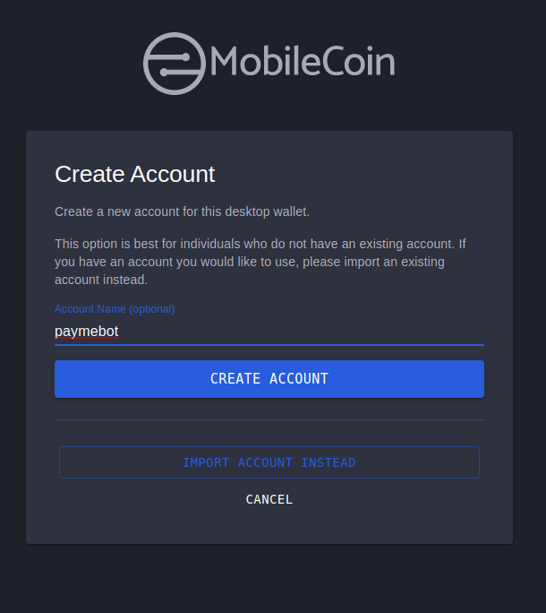

If you've already followed the readme on the root of the directory you're ready to deploy echopay. Otherwise, please go do it now!

## High Level Overview ##

In this tutorial you will
* learn how to use auxin-cli
* learn how to set a payments address on auxin-cli
* send and receive payments with Signal
* deploy echopay, a bot that receives payments and then sends the money back

So, let's get started.

## Auxin CLI ##

Auxin CLI is a rust-based Signal command line client that allows sending and receiving Signal messages. It is not yet a full replacement to Signal-cli, but it also supports certain features of Signal that Signal-cli does not. Namely, payments.

Here's how to install Auxin-cli and activate Payments for your bot's signal account.

### Install prerequisites ###

You'll need a working rust enviornment on your system to build Auxin. 
- [Follow these instructions to install rust on your computer.](https://www.rust-lang.org/learn/get-started) 
- Then change your default rust toolchain to the [nightly channel](https://rust-lang.github.io/rustup/concepts/channels.html):
    ```bash
    rustup default nightly
    ```
- Finally verify that rust installed correctly by running `cargo --version`:
    ```bash
    cargo --version
    ```
    ```bash
    cargo 1.60.0-nightly (95bb3c92b 2022-01-18)
    ```  
<br>

### Building Auxin-cli from source

Once you have rust set up properly you can build Auxin-cli from source. 

- Clone the [Auxin repo](https://github.com/mobilecoinofficial/auxin) and cd into it
    ``` bash
    git clone https://github.com/mobilecoinofficial/auxin.git
    cd auxin
    ```  

- Run `cargo build --release`
    ``` bash
    cargo build --release
    ```
    - Auxin might prompt you to install certain other dependencies such as `libssl`, or `pkg-config`, if it does so, install the appropriate packages and run `cargo build --release` again.  

- When the build finishes succesfully, `auxin-cli` will be in `./target/release/auxin-cli`. Verify that the installation succeded by invoking it.

    ```bash
    ./target/release/auxin-cli 
    ```
    ```bash
    auxin-cli 0.1.11
    ```
- Finally SymLink auxin-cli to your forest directory.
    ```bash
    cd ../forest
   
    ln -s ../auxin/target/release/auxin-cli .
   
    ./auxin-cli --version
    ```
    ```
    auxin-cli 0.1.11
    ```

### Send a message with Auxin ###

Since Auxin is fully compatible with signal-cli datastores, you should easily be able to send a message with it as you could with signal-cli. 
```bash
./auxin-cli --config . --user $BOT_NUMBER send $ADMIN -m "hello"
```
```bash
Successfully sent Signal message with timestamp: 1643064362099
```
You should have received a Signal message on your device. You will note that the syntaxt for sending a message with Auxin is very similar to Signal-cli. However there are some difference. For more information about Auxin-cli, checkout it's github repo, or invoke it's help dialog with `./auxin-cli --help`

### Run Hello Bot With Auxin ###

Auxin can run hellobot as good as signal-cli. To test hellobot with auxin, edit your dev_secrets file to the following:

```bash
NO_MEMFS=1
ROOT_DIR=.
SIGNAL=auxin
ADMIN=+15551111111
BOT_NUMBER=+15551234567
NO_DOWNLOAD=1
NO_MONITOR_WALLET=1
```
Then run hellobot as usual with:
```bash
pipenv run python -m sample_bots.hellobot
```
<br>


## MobileCoin Wallet and Full Service ##

Now for the payments enabled part of payments-enabled Signal bot. Signal Pay uses a lightweight version of the MobileCoin wallet called Fog. For running a bot however, we want to use the full service version of the wallet, appropriately named Full Service. The easiest way to create and use a MobileCoin Wallet is with the Desktop Wallet which can be installed here.

Running the MobileCoin Desktop Wallet creates an instance of Full Service. Full Service is, at its core, a client that talks to MobileCoin consensus nodes and allows you to submit transactions and receive transactions. The Desktop Wallet uses Full Service to interact with the MobileCoin Blockchain. You can use this instance of Full Service to create additional accounts.

Forest bots interact with a Full Service instance through HTTP. When you start the desktop wallet, it opens a socket on `http://127.0.0.1:9090/wallet`. You can put this URL in your dev_secrets file and the bot will be able to communicate with your wallet, meaning it can send and receive MOB and create separate accounts. If you don't want to use your main account for your bot, and in fact we recommend you don't, you can create a separate account in the desktop wallet and use that. That's what we'll be doing in this tutorial. If you want to host your bot on a server or cloud instance, you must enact additional security to ensure only authorised requests are being made to full-service. We'll explain one way to do that at the end.

For the purposes of the tutorial, do the following. Open the Desktop Wallet and create a new account called `paymebot`.



Once you've done that, you can put your Full Service URL and Full Service account name in your dev_secrets file:

``` bash
NO_MEMFS=1
ROOT_DIR=.
SIGNAL=auxin
ADMIN=+15551111111
BOT_NUMBER=+15551234567
NO_DOWNLOAD=1
FULL_SERVICE_URL=http://127.0.0.1:9090/wallet
FS_ACCOUNT_NAME=paymebot

```

With these, you're ready to run Echopay

## Echopay aka PayMeBot ##

Just like Hellobot is the simplest possible forest bot that reads and replies to messages. Echopay is the simplest possible bot that sends and receives payments. It used to be a bot that took any payment and returned it to sender, minus the network fee, hence the name Echopay. Now it is a bot with 3 capabilities:

- Pay an user that messages it
- Receive payments from an user and reply to thank them
- Allow an admin to send a payment to a third party.

You could run:

```bash
pipenv run python -m echopay.echopay
```

To try it right now, but first let's go through the code a little bit to make sure you understand it. 

<br/>

### Set Payment Address  


If you look in echopay Py, one of the first things you'll see is that we've overloaded the `__init__` method:

```python
def __init__(self) -> None:
        """Creates AND STARTS a bot that routes commands to do_x handlers"""
        super().__init__()
        asyncio.create_task(self.set_payment_address())
```


The first thing we do is call `super().__init__()` to run the proper init method inherited from the PayBot class. Then `asyncio.create_task(self.set_payment_address())` calls the `set_payment_address` function, which is below:

```python
async def set_payment_address(self) -> None:
        """Updates the Bot Signal Profile to have the correct payments address
        as specified by FS_ACCOUNT_NAME"""

        fs_address = await self.mobster.get_my_address()

        # Singal addresses require Base64 encoding, but full service uses Base58.
        # This method handles the conversion
        signal_address = mc_util.b58_wrapper_to_b64_public_address(fs_address)

        await self.set_profile_auxin(
            given_name="PaymeBot",
            family_name="",
            payment_address=signal_address,
            profile_path="avatar.png",
        )
```
`set_payments_address` first calls `mobster.get_my_address()` a method which returns a Mobilecoin wallet address from the running full service instance. It will search for an `FS_ACCOUNT_NAME` in dev_secrets, if it finds an account with that name it'll return that address, otherwise it defaults to the first account in Full Service. The method then sends a message to Signal's servers to update the bot's user profile. Crucially it sets a payment's address for the bot. This will allow the bot to receive payments on Signal, and have those payments be deposited on that Full Service account. It will also set the bot's behaviour to extract funds from that account when the bot sends a payment. These properties are linked but not one and the same. This method takes care of both.

Additionally, you can change the bot's given name, last name, and profile picture here by editing the appropriate values. The avatar file must be in the directory you're running the bot from. The name of the bot does not have to match the `FS_ACCOUNT_NAME`.

<br />

## do_payme

The next main important function is `do_payme`, as you know, any function with the `do_` prefix translates to a command that the user can message the bot. do_payme runs whenever an user texts the bot "payme".


Here's what that method looks like:

```python

async def do_payme(self, message: Message) -> Response:
        """Sends payment to requestee for a certain amount"""
        amount_mob = 0.001  ##payment amount in MOB
        amount_picomob = self.to_picomob(amount_mob)

        await self.send_payment(
            message.source, amount_picomob, confirm_tx_timeout=10,      
            receipt_message=""
        )

        
        return f"Sent you a payment for {str(amount_mob)} MOB"
```
This method has a predefined amount of Mob it gives out, in this case $0.001 Mob. All of the payment methods in forest.core use picoMOB ammounts since that's the lowest precision available to MOB. 1 pMOB is 1*10^`12 MOB or $0.000000000001 MOB. 1MOB is 10^12 pMOB or 10000000000000 pMOB.

We use a helper method to handle the conversion and then we're ready for `send_payment`. `send_payment` will send a payment to a user and we're calling it with the following arguments:

- `recipient=message.source` This means takes the phone number of whomever sent the `payme` command and use that as the recipient for the payment.
- `amount_picomob` The payment amount in picomob which we got by converting amount_mob to picomob. Should be 0.001 MOB or 1000000000 pMOB.
- `confirm_tx_timeout=10` This is how long the bot waits to verify that the transaction has completed before sending a receipt. It waits 10 seconds, more than enough.
- `receipt_message` (this section will change cause I want to change the messaging logic to only work on success)

So this code will send 0.01 MOB to anyone that asks. You can modify it to change the amount. However, this isn't very nice, that means anyone can spam your bot to empty it's wallet. Maybe we can add some logic to prevent people from doing that. One easy way to do it is to set a password so only people who've been given the password can get paid.

In echopay_final.py there's an example of such a modification:

``` python
async def do_payme(self, message: Message) -> Response:
        """Sends payment to requestee for a certain amount"""
        amount_mob = 0.001  ##payment amount in MOB
        amount_picomob = self.to_picomob(amount_mob)

        password = "please"

        # for convenience, message.arg0 is the first word of the message in this case "payme"
        # and msg.arg1 is the next word after that. In "payme please" please is msg.arg1

        if message.arg1 == password:
            await self.send_payment(message.source, amount_picomob)
            return f"Of course, here's {str(amount_mob)} MOB"

        if message.arg1 is None:
            return "What's the secret word?"

        return "That's not the right secret word!!"
```

This code sets the password to the word "please" and will only pay user's if they type "payme please". Of course if someone can see your code they can find your password pretty easily. Also anyone with the password can still spam the bot. Ways to further modify the code are left as an exercise to the reader.

<br />

### do_pay_user

`do_pay_user` makes use of the `@requires_admin` annotation. Any method with this annotation will only work when an user listed as an admin in dev_secrets texts the bot. (This is currently buggy so don't trust it too much) When an admint texts "pay_user" followed by a phone number, the bot will attempt to send that user a payment.


 Here's what that method looks like:

```python
@requires_admin
    async def do_pay_user(self, message: Message) -> Response:
        """Send payment to user by phone number: `pay_user +15554135555`"""
        amount_mob = 0.001
        amount_picomob = self.to_picomob(amount_mob)

        ## message.arg1 is the first word of the message after the pay_user command

        if not isinstance(message.arg1, str):
            response = (
                "Please specify the User to be paid as a phone number"
                " with country code example: pay_user +15554135555"
            )
            return response

        recipient = message.arg1
        await self.send_payment(
            recipient,
            amount_picomob,
            confirm_tx_timeout=10,
            receipt_message="Here's some money from your friendly Paymebot",
        )
        return f"Sent Payment to {recipient} for {amount_mob} MOB"
```
The body of this method looks pretty similar to `do_payme`, but there are a couple crucial differences. First, it takes an argument. Forest Core implements a special type of message parsing where the first 4 words of a message (as delineated by spaces `" "`) are defined as arg0 to arg3. So if someone sends 

`pay_user +15554135555`

`arg0 = "pay_user"`  
`arg1 = "+15554135555`  
`arg2 = ""`  
`arg3 = ""`  

`if not isinstance(message.arg1, str):` checks to make sure arg1 is defined and is a string. Which won't happen if the message is only the one word. If not it instructs the user to add a phone number. Otherwise it calls the send_payment method. We're not doing any logic to verify that the phone number is formatted properly. `send_payment` already checks that for us and will return an error if not.

 The main difference in this call to `send_message` and the one in `do_payme` is that we've added a receipt_message. This message will be sent to the recipient of the payment if the payment succeeds. The method also returns a message, this message is sent to the admin that requested the payment.

 A fun way to modify this method is implemented in `echopay_final`. It allows you to specify an payment amount as the second argument in the message, defaulting to the original payment_amount if none is specified. (again be careful with this, since requires_admin is not working properly and someone could use this to again, clear your bot's account)

 ```python
@requires_admin
    async def do_pay_user(self, message: Message) -> Response:
        """Send payment to user by phone number: `pay_user +15554135555`"""
        amount_mob = 0.001
        amount_picomob = self.to_picomob(amount_mob)

        ## message.arg1 is the first word of the message after the pay_user command

        if not isinstance(message.arg1, str):
            response = (
                "Please specify the User to be paid as a phone number"
                " with country code example: pay_user +15554135555"
            )
            return response

        if isinstance(message.arg2, str):
            amount_mob = message.arg2
            try:
                amount_picomob = self.to_picomob(amount_mob)
            except:
                return "That didn't look like a valid amount of MOB."


        recipient = message.arg1
        await self.send_payment(
            recipient,
            amount_picomob,
            confirm_tx_timeout=10,
            receipt_message="Here's some money from your friendly Paymebot",
        )
        return f"Sent Payment to {recipient} for {amount_mob} MOB"
```

<br /> 

### payment_response

`payment_response` is the second overloaded method in Echopay. `payment_response` is the method that triggers upon receiving a signal pay payment. 


This method is wide open. Return values are sent as messages to the payer and payer information comes along with the message.

```python
    async def payment_response(self, msg: Message, amount_pmob: int) -> Response:
        """Triggers on Succesful payment, overriden from forest.core"""

        # amounts are received in picoMob, convert to Mob for readability
        amount_mob = self.to_mob(amount_pmob)

        return f"Thank you for your payment of {str(amount_mob)} MOB"

```

As it is now, all it does is thank the user for their payment. As you see the available information is the msg, of which msg.source is the payer. And the payment amount in picoMob. How can we make this method more exciting, well we can reimplement the original echopay functinality like so:


```python
    async def payment_response(self, msg: Message, amount_pmob: int) -> Response:
        """Triggers on Succesful payment, overriden from forest.core"""

        # amounts are received in picoMob, convert to Mob for readability
        amount_mob = self.to_mob(amount_pmob) 

        to_return = amount_pmob - FEE_PMOB

        
        await self.send_payment(
            msg.source,
            to_return,
            confirm_tx_timeout=10,
            receipt_message="",
        )
        [the thing to make sure the payment actually went]
            return f"Thank you for your payment of {str(amount_mob)} MOB. Here's your money back, minus the network fee"

        return f"Couldn't return your payment for some reason. Please contact administrator for assistance"

```

## Try it out

Now that you understand how the bot works, you can try running it with 

```bash
pipenv run python -m echopay.echopay
```

And try out all the functions yourself. You'll have to seed the bot with some MOB to start with. If you need to buy MOB you can do so at [buymobilecoin.com](https://buymobilecoin.com)

Try it out and make changes!

## Next Steps: infrastructure

Now you can take advantage of the full features of the forest ecosystem. It's time to start developing. Running locally is fine for testing, but for more robust applications you'll want to host on a service or on a cloud. Check out the following tutorials: 

- [Deploy Full Service to Fly with certificate Pinning for Security](https://github.com/i-infra/cert-pinning-demo)
- Deploy a Forest Bot to Fly.io (Under Construction)

## Contributing

We welcome pull requests, and issues. We lint out code with Pylint and MyPy and format it with Black.
