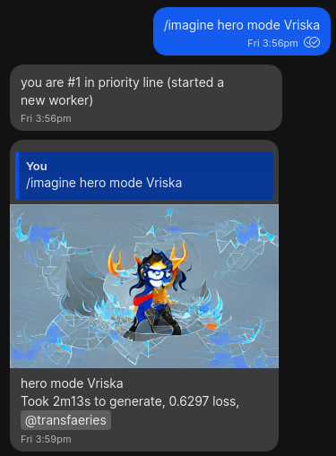
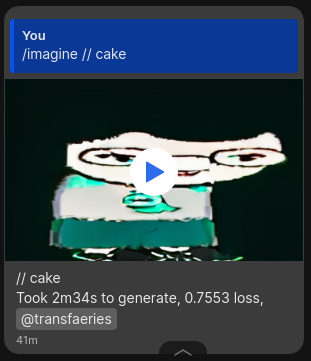

# Imogen: Imoge Generator

Imogen is a Signal Bot that generates images using VQGan and CLIP. These images are often affectionately referred to as Imoges. To have Imogen generate an Imoge for you you can join Imogen's Signal Group Chat.

### Imogen on Signal

[I, Imogen](https://signal.group/#CjQKIEP344g-nF0eIcaZkORbofLzTSlD5DKOUeGEFbus-w9uEhBzb6Q51MWZw6nSDkGLhwKN), Signal Group Chat where you can request Imoges. Since this is a public group we ask that you observe certain guidelines:
- Treat all users in the group respectfully, this includes Imogen herself.
- Be mindful of what prompts you request in public.
- The administrators reserve the right to remove anyone from the group for any reason.
 

### Imogen on Twitter ###

Imogen posts all the images from groups on [her Twitter account](https://twitter.com/dreambs3). You can browse there to get an idea of what other users are collaborating with Imogen. Since posts in the group get posted to twitter automatically, please be mindful of your prompts to Imogen. Ask an administrator if you want an Imoge taken down from Twitter. 

# How To Use #

In a Group or a direct message send a message of the form:

`   
/imagine [prompt]
`

Where [prompt] is a description of the image you want to generate. Imogen will generate an imoge for you based on the prompt:

`/imagine` uses the [ImageNet dataset](https://www.image-net.org/) as the training data for its images. This is a general dataset trained on many images on the Internet. Using the `/paint` command instead will generate an image using the [WikiArt dataset](https://github.com/cs-chan/ArtGAN/blob/master/WikiArt%20Dataset/README.md), which produces more painting-like images:

`
/paint [prompt]
`

 

There are some special commands to specify style for the image.
- /dark_fantasy
- /pastel,
- /psychic,
- /synthwave,
- /ukiyo,
- /vibrant

These are equivalent to appending the style after the imagine prompt. `/dark_fantasy Kirby` -> `/imagine dark fantasy Kirby`

Imogen can draw in many more styles than those, try asking for a style you like, or ask her to channel a particular artist's style.

## Priority Queue ##

Imogen features a priority queue that will guarantee your image is generated sooner in times of high activity. To make use of Imogen's paid features send her a payment with Signal Pay. To do this first make sure you have [Payments enabled on Signal](https://support.signal.org/hc/en-us/articles/360057625692-In-app-Payments). Then send Imogen a direct message and attach a payment using the + button.

You can message Imogen by visiting  [this link](https://signal.me/#p/+14159495511 ) which will open on Signal Messenger.  

   

You will receive a direct message informing you of the receipt of your payment and your new balance.

You can check your current balance with `/balance`.

When you have Imogen balance your requests are automatically added to the priority queue. The current cost per image is USD $0.10. 

Imogen will inform you via direct message when your balance reaches 0. At that point you may continue using the free Imogen queue, or send another payment to top up your balance.

 

### Additional Perks of the Priority Queue ###

There's a per person limit of how many prompts you can have Imogen generate at once. Priority requests bypass that limit. There might also be additional paid features in the future. If you have a good idea for a paid feature, please submit it as a feature request. 

Imogen wishes to remain free for anyone to collaborate with her. By making use of the paid queue and tips you can ensure that Imogen continues to collaborate on art with users from all over the world.

 
 

## Tipping ##

You can donate tips to Imogen to show your support. If you have Imogen balance, you can tip some of that balance by using `/tip [amount]`, amounts are currently in USD.

Using `/tip all` will donate your whole balance as a tip.

Finally, you can send a payment as a tip directly by writing "Tip" in the notes field for the payment. Your payment will automatically be added as a tip to Imogen.

 

## Full list of available commands ##

`/balance`  
returns your Imogen balance for priority requests

`/help`  
Display the help text

`/help [commmand]`  
Explains a specific Command

`/imagine [prompt] `  
Generates an image based on [prompt]. 

`/nopost [prompt]`  
Functions like the `/imagine` command but the generated Image does not post to Twitter.

`/paint [prompt]`  
Generate an image using the WikiArt database and your prompt, generates painting-like images.

`/tip [ammount]`  
Subtracts [ammount] from your Imogen Balance and donates it as a tip. Ammounts are in USD.

`/tip all`  
Subtracts all your available balance and donates it as a tip.

`/signalpay`  
Displays the Signal Pay help text which will help you get set up sending and receiving payments over Signal. You can use Signal Pay to make use of Imogen's paid features.

`/status `  
Displays Imogen's status

## Advaced Techniques ##

### Starting Image: ###

Imogen can generate your image based on a starting image. Attach an image and use one of the generative commands (`/imagine`, `/paint`) and Imogen will generate an image based on your prompt and the starting image.

  

### Videos: ###
You can give imogen multiple prompts separated by "//" and Imogen will generate a video that transitions between the prompts. Will take longer than a regular `/imagine`.
Example:  
`/imagine Jane // Cake `

  

### Transform: ###
You can combine the starting image and the video functionality to make images that dissolve into imoges. 
Attach an image and use one of the generative commands, start your prompt with `//` and your target. Example:  

`/imagine // cake`

  

# Under the Hood #

Imogen is composed of two separate systems. There's the machine learning program that trains the models to generate the images. And then there's the queue management system and Signal interface. The code in this repository constitutes the latter.

## Contributing to Imogen ## 

We welcome pull requests, and issues, but most importantly you can contribute to Imogen by collaborating with her. Join the Signal Groups, make art with her, use her paid features and donate tips. 

There's often discussions about the science and machine learning models behind Imogen on these groups, and you can help by participating in those discussions.

