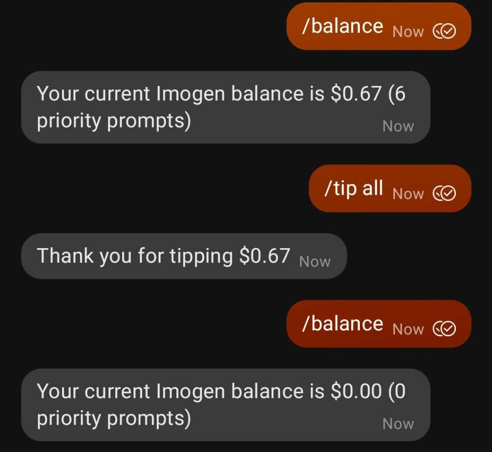

# Imogen: Imoge Generator

Imogen is a Signal Bot that generates Images using VQGan and CLIP. To have Imogen Generate an Imoge for you you can join one of the group chats or message Imogen directly.

## Imogen Group Chats ##

[Imogen Public](https://signal.group/#CjQKIBMsSPcIQYNjlSA1C1NqvapdjiZX31bdrCpH4ZI9BbwEEhAHOP7DVF1GjizAzYmOnDcY), the original Imogen group.

[I, Imogen](https://signal.group/#CjQKIEP344g-nF0eIcaZkORbofLzTSlD5DKOUeGEFbus-w9uEhBzb6Q51MWZw6nSDkGLhwKN), newer Imogen group.

[Imogen (direct message)](https://signal.me/#p/+14159495511
)

## Twitter ##

Imogen posts all her images on (her Twitter account)[].

# How To Use #

In a Group or a DM message:

`   
/imagine [prompt]
`

And Imogen will generate an Image for you based on the prompt:

`
/paint [prompt]
`

Will generate an image using the wikiart database, which produces more painting-like images:

 

There are some special commands to specify style for the image.
- /dark_fantasy
- /pastel,
- /psychic,
- /synthwave,
- /ukiyo,
- /vibrant

These are equivalent to appending the style after the imagine prompt. `/dark_fantasy Kirby` -> `/imagine dark fantasy Kirby`

Imogen can draw in many more styles than those, try asking for a style you like, or ask her to channel a particular artist's style.

## Priority Queue ##

Imogen features a priority queue that will guarantee your image is generated sooner in times of high activity. To make use of Imogen's paid features you must send her a payment with Signal Pay. To do this first make sure you have Payments enabled on Signal. Then DM Imogen and attach a payment using the + button.

   

You will receive a DM informing you of the receipt of your payment and your new balance.

You can now use the `/priority` command to requests images on the priority queue. `/priority` works just like `/imagine` and `/priority-paint` works just like `/paint`.

You can check your current balance with `/balance`.

 
 

## Tipping ##

You can donate tips to Imogen to show your support. If you have Imogen balance, you can tip some of that balance by using `/tip [ammount]`, ammounts are in USD.

Using `/tip all` will donate your whole balance as a tip.

Finally, you can send a payment as a tip directly by writing "Tip" in the notes field for the payment. Your payment will automatically be added as a tip to imogen.

 

## Full list of available commands ##

`/balance`  
returns your Imogen balance for priority requests

`/help`  
Display the help text

`/help [commmand]`  
Explains a specific Command

`/imagine [prompt] `  
Generates an image based on your prompt. Request is handled in the free queue, every free request is addressed and generated sequentially.

`/paint [prompt]`  
Generate an image using the WikiArt database and your prompt, generates painting-like images. Requests handled on the Free queue.

`/priority [prompt] `  
Like /imagine but places your request on a priority queue. Priority items get dedicated workers when available and bypass the free queue.

`/priority-paint [prompt]`  
Like /paint but places your request on the priority queue. Priority items get dedicated workers when available and bypass the free queue. 

`/tip [ammount]`  
Subtracts [ammount] from your Imogen Balance and donates it as a tip. Ammounts are in USD.

`/tip all`  
Subtracts all your available balance and donates it as a tip.

`/status `  
Displays Imogen's status

## Advaced Techniques ##

### Starting Image: ###

Imogen can generate your image based on a starting image. Attach an image and use one of the generative commands (`/imagine`, `/paint`, `/priority`, `/priority-paint`) and Imogen will generate an image based on your prompt and the starting image.

  

### Videos: ###
You can give imogen multiple prompts separated by "//" and Imogen will generate a video that transitions between the prompts. Will take longer than a regular /imagine.
Example:  
`/imagine Jane // Cake `

  

### Transform: ###
You can combine the starting image and the video functionality to make images that dissolve into imoges. 
Attach an image and use one of the generative commands starting with Slash.
with image attached 
`/imagine // greek bust`

  

# Under the Hood #

Imogen is composed of two separate systems. There's the machine learning program that trains the models to generate the images. And then there's the queue management system and Signal interface. The code in this repository constitutes the latter.

## Contributing to Imogen ## 

We welcome pull requests, and issues, but most importantly you can contribute to Imogen by collaborating with her. Join the Signal Groups, make art with her, use her paid features and tip her. 

There's often discussions about the science and machine learning models behind Imogen on these groups, and you can help by participating on those.

